# 🎮 Priestess's Arknights Simulator

## ✨ 한 줄 소개

여러 연속된 가챠 일정을 10만회 ~ 100만회까지 반복 실행하는 시뮬레이터

## 🔗 프로젝트 링크

👉 [Priestess's Arknights Simulator](https://arknightsimulator.xyz)

## 🛠 주요 기능

이 시뮬레이터는 아래와 같은 질문에 대한 답을 제공합니다:

- 🎯 지금 재화 상태에서 입력한 일정을 끝까지 소화할 확률
- 💰 가챠 일정을 성공하는 데 드는 평균적인 재화
- 📊 전체 일정에서 각 가챠 배너가 차지하는 비중
- ⚠️ 현재 재화와 목표 조건으로 주로 어디서 실패하게 되는지
- ❌ 각 배너별 실패 비율과 실패한 이유
- 🔄 반복 중 각 배너에서 평균적으로 소모된 재화

## 🖥 기술 스택

### Frontend

### Styling

### Data Visualization

### Animations

### Code Quality

### Backend / Storage

## 🚀 사용 방법

### 1️⃣ 사이트 접속

🌐 **사이트 접속** 👉 [Priestess's Arknights Simulator](https://arknightsimulator.xyz)

---

### 2️⃣ 시뮬레이션 시작

▶️ **[시작 버튼] 클릭**

- 미리 설정된 일정으로 **20만회 반복 시뮬레이션** 실행
- 설정이나 배너 변경 시 **[리셋] 버튼**으로 **초기 환경 복원**

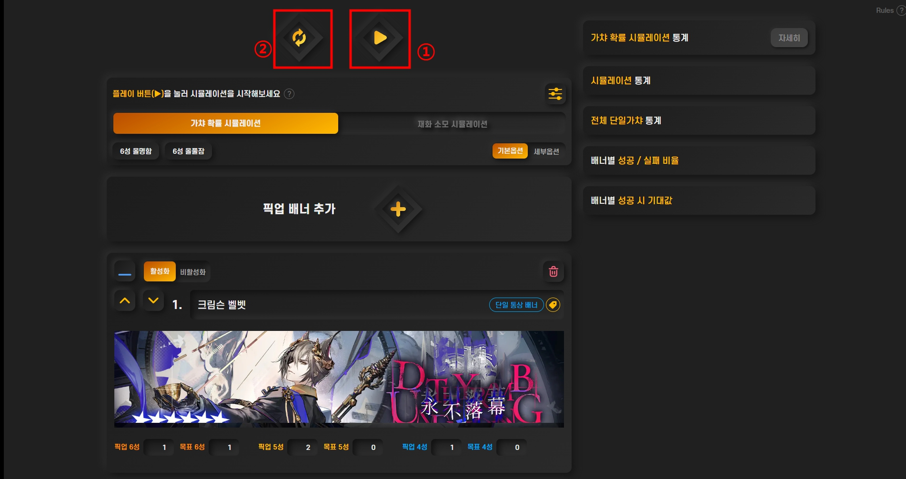

---

### 3️⃣ 시뮬레이션 진행

⏳ **CPU 연산 진행** (**최대 수십 초**)

- 도중에 **[STOP] 버튼**으로 시뮬레이션 **중지 가능**

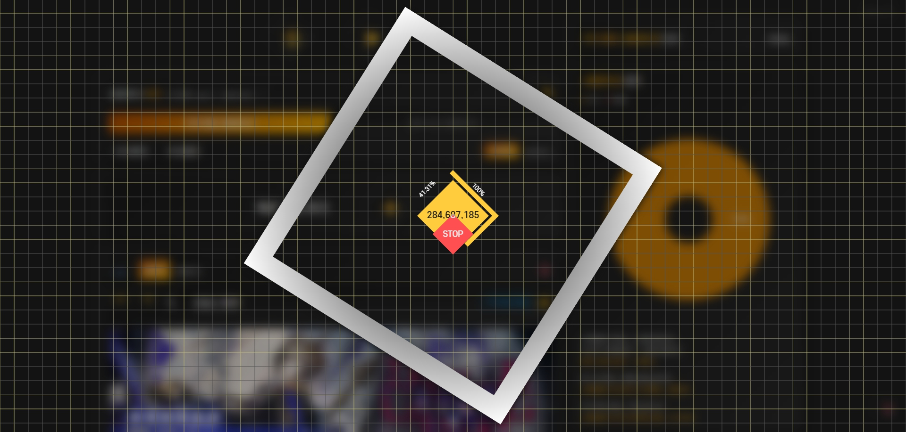

---

### 4️⃣ 통계 확인

📊 **[자세히 버튼] 클릭**

- 본격적인 **통계 데이터 확인** 가능
- 각 데이터 **해석**은 아래 섹션에서 추가 소개

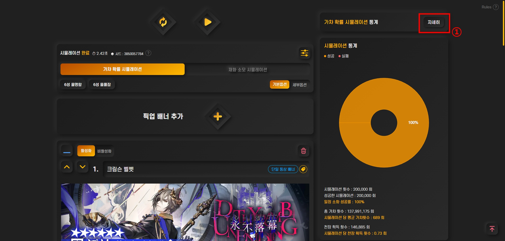

---

### 5️⃣ 배너 추가 방법

➕ **[픽업 배너 추가] 버튼 클릭**

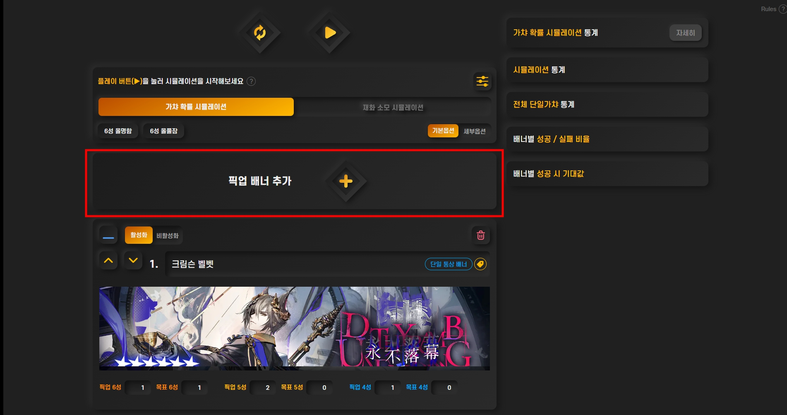

📦 **[프리셋 탭] 활용**

- 미리 준비된 최신 픽업 배너 중 하나를 클릭하여 가져오기

🛠 **커스텀 탭 활용**

- 프리셋에 없는 로테이션, 3중/4중 가챠 배너를 추가하고 싶을 때 사용

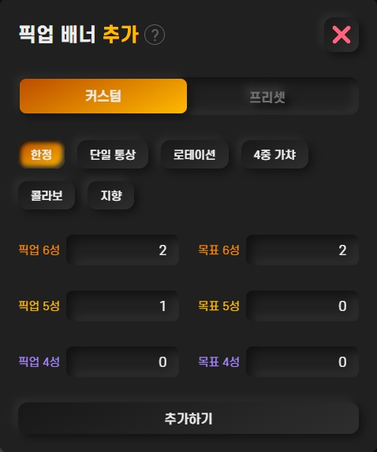

---

### 6️⃣ 시뮬레이션 옵션 사용 방법

⚙️ **슬라이드 바 옵션**

- **[가챠 확률 시뮬레이션] / [재화 소모 시뮬레이션]** 슬라이드 바

---

#### 🎲 [가챠 확률 시뮬레이션] 활성화

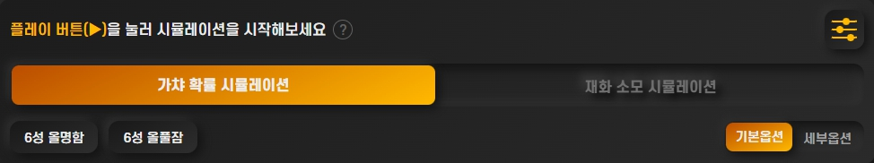

- 재화 제한 없이 배너 목표 달성 시 필요한 재화를 계산
- 시뮬레이션 목표가 "크림슨 벨벳 배너에서 트라고디아 명함을 얻으려면 평균적으로 재화가 얼마나 필요할까?"과 같을 때 사용

---

#### 💰 [재화 소모 시뮬레이션] 활성화

- 현재 재화를 다 쓸 때까지 가챠 시도
- 시뮬레이션 목표가 "합성옥 200,000개로 모든 목표 달성 가능 확률은?"과 같을 때 사용
- 초기 재화 입력 필드에 현재 보유 재화를 입력

---

#### 🎯 6성 목표 옵션

- **[6성 올명함]**: 모든 배너 6성 목표를 **올명함**으로 설정
- **[6성 올풀잠]**: 모든 배너 6성 목표를 **올풀잠**으로 설정
- 배너별 옵션보다 **우선순위 높음**, 클릭 시 해제 가능

---

#### 📝 기본 옵션 / 세부 옵션

- **[기본옵션]**: 각 배너의 현재 6, 5, 4성 픽업 오퍼레이터 수와 목표 수만 입력
- **[세부옵션]**: 아래 세부 설정 가능
  - 최대/최소 시도 횟수
  - 첫 6성 하나만 뽑기
  - 배너 총 픽업 6,5,4성 수
  - 목표 픽업 오퍼레이터 목록
  - 픽업 오퍼레이터 목표 잠재 횟수, 현재 잠재 횟수
  - 오퍼레이터 추가 버튼

---

#### ⚙️ 시스템 옵션

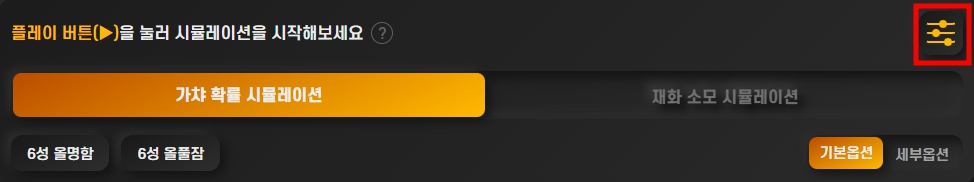  
-옵션 바 오른쪽 위 버튼을 클릭시 아래와 같은 [시스템 옵션]이 열림

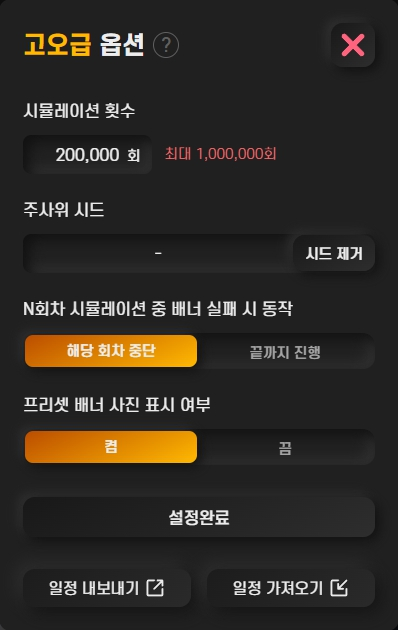

- **최대 시뮬레이션 횟수**: PC 100만회, 모바일 20만회 제한
- **주사위 시드**: 동일 배너 조건에서 같은 결과 재현 가능  
  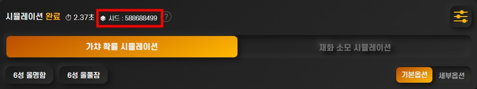

- **N회차 시뮬레이션 중 배너 실패 시 동작**
  - **[해당 회차 중단]**: 배너 실패 시 해당 회차 종료
  - **[끝까지 진행]**: 배너 실패해도 마지막 배너까지 시뮬레이션 진행

- **프리셋 배너 사진 표시 여부**: On/Off
- **[일정 내보내기] / [일정 가져오기]**:
  - 현재 배너 및 옵션 JSON 파일로 저장/불러오기
  - 드래그로 파일 가져오기 가능  
    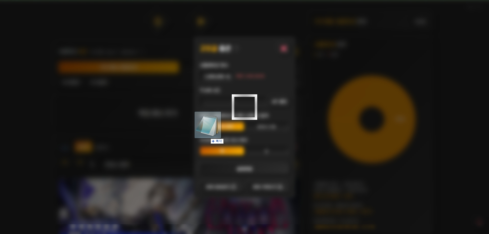  
    ⚠️ 임의로 수정된 파일은 에러 발생 가능성 높음, 임의 수정 금지

---

### 7️⃣ 배너별 적용 옵션 사용 방법

#### 📌 공통 옵션

- 🔴 **1번 박스: [최소화] / [최대화]**
  - 헤더 영역만 남기고 배너 최소화/최대화

- 🔴 **2번 박스: [활성화] / [비활성화]**
  - 시뮬레이션에서 해당 배너 제외 시 사용
  - 삭제하지 않고 비활성화 가능, 비활성화 시 자동 최소화 적용

- 🔴 **3번 박스: [순서 올리기] / [순서 내리기]**
  - 배너 순서 변경 가능

- 🔴 **4번 박스: [삭제 버튼]**
  - 배너를 일정에서 **영구 삭제**

- 🔴 **5번 박스: [배너 타입 뱃지]**
  - 배너 유형 선택 가능, 클릭 시 모달 표시
  - 뱃지 수정 시 픽업/목표 오퍼레이터 수가 자동 조정될 수 있으므로 주의  
    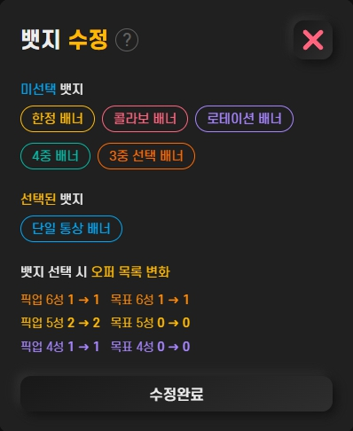

---

#### 📝 기본 옵션 모드

- 각 배너의 **픽업 6,5,4성 오퍼레이터 수**와 **목표 수** 입력
- [재화 소모 시뮬레이션] 모드: **[추가 재화]** 입력 가능
  - 배너 도달 시 입력한 만큼 재화를 추가하여 가챠 진행

---

#### 🛠 세부 옵션 모드

- **[최대 시도]**: 배너 최대 시도 횟수 제한 (최대 3000회, 무제한 시 3000회 입력과 동일)
- **[최소 시도]**: 최소 시도 횟수 제한 (예: 300연차 이전에도 가챠 진행)
- **[첫 6성]**: 배너에서 최초 6성 등장 시까지만 가챠 진행
- **[픽업 오퍼레이터 수]**: 배너 6,5,4성 픽업 수 입력 (기본 제공, 최대값 제한 있음)
- **[목표 픽업 목록]**: 배너 목표 오퍼레이터 구체 입력
  - 명함만 / 풀잠 목표 선택 가능
  - 구 오퍼 배너의 경우 현재 잠재 수치 입력 가능
  - [천장], [통상], [6성] 뱃지 클릭으로 모달에서 정보 수정  
    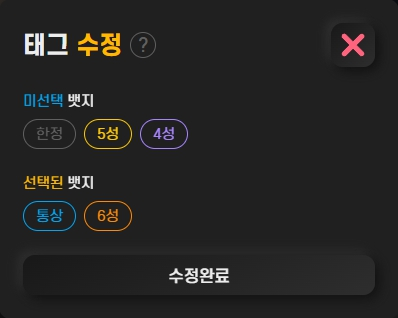
  - 비활성화 태그: 배너에서 더 이상 추가 불가 또는 다른 뱃지와 충돌
  - [천장] 뱃지: 시스템 내부에서 주어지며, 시뮬레이션 천장 보상으로 결정

- **[추가 재화]**:
  - [재화 소모 시뮬레이션] 모드에서 해당 배너 도달 시 입력한 만큼 재화를 추가하여 가챠 진행

---

#### ❓ 도움말 보기

- 가챠 시뮬레이션 내 **[ ? ] 버튼** 클릭 시, 각 옵션과 기능에 대한 **도움말** 확인 가능

## 📄 라이선스

MIT
